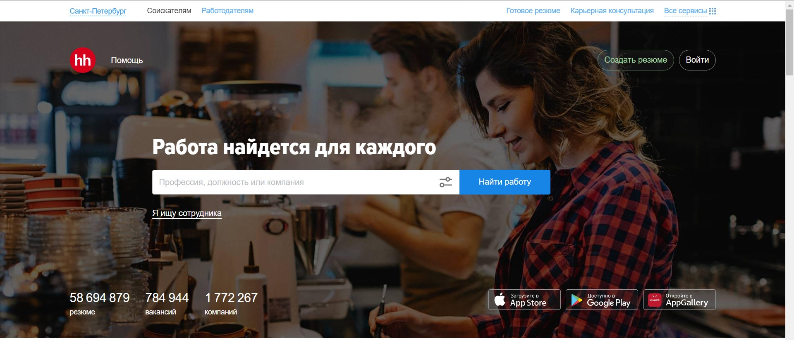
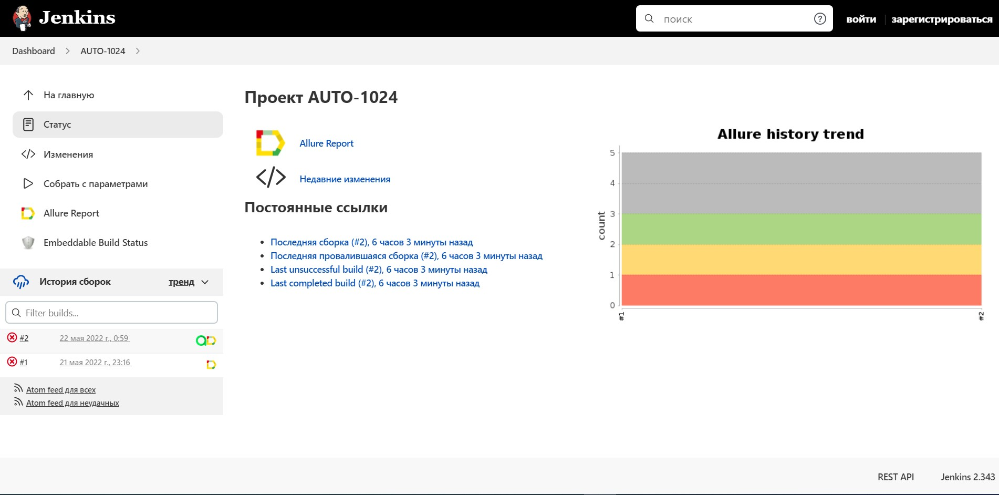
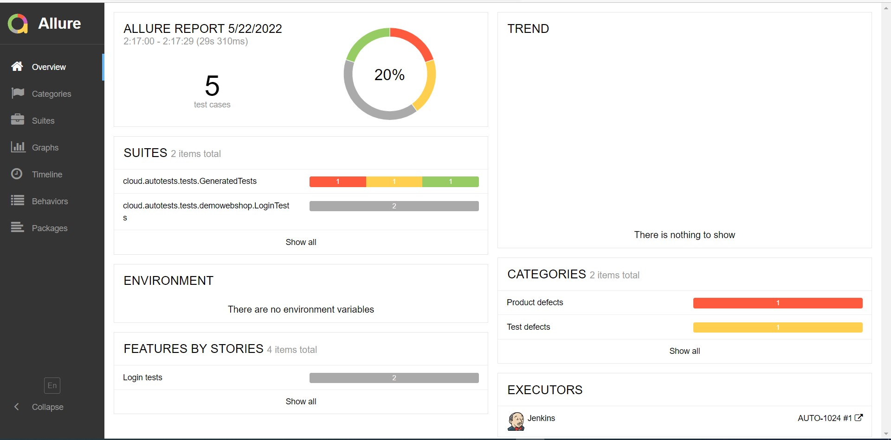
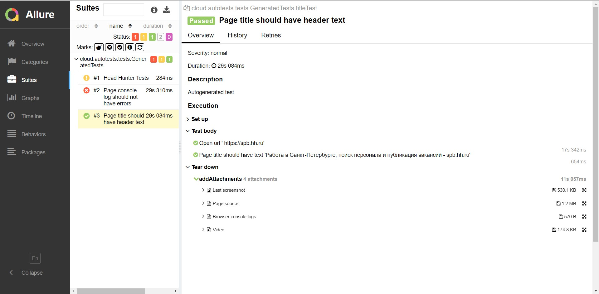
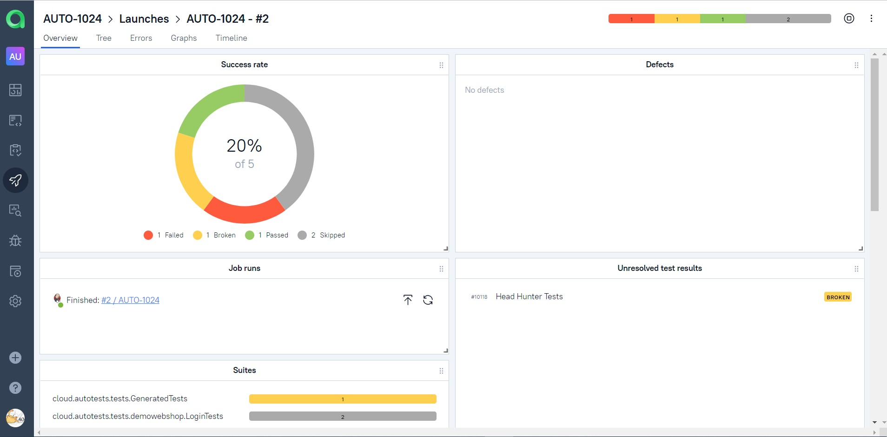
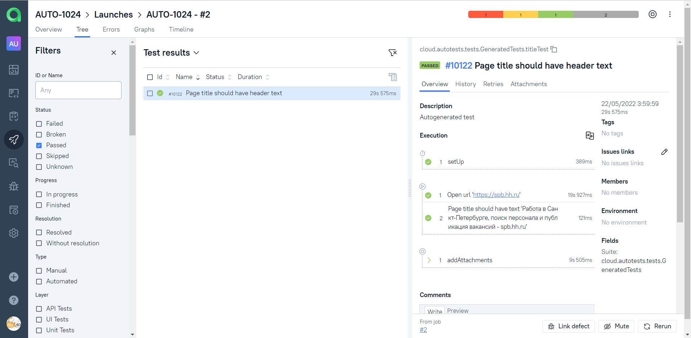
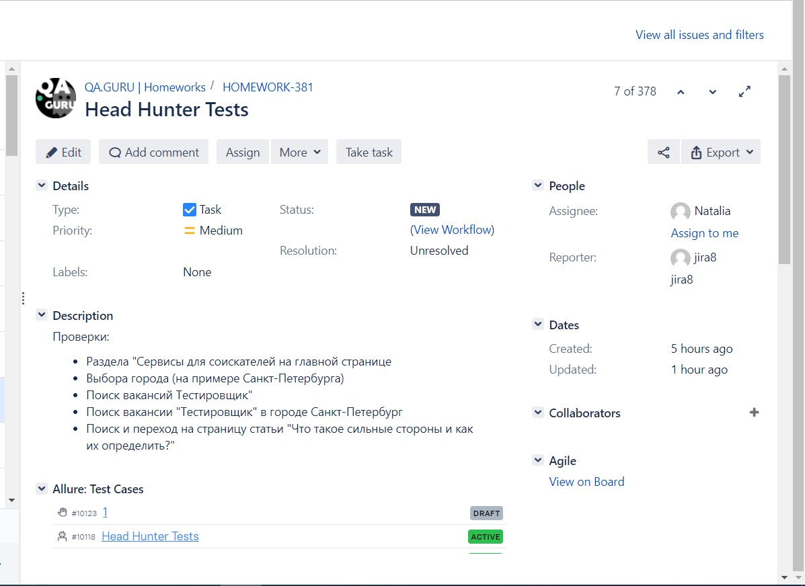
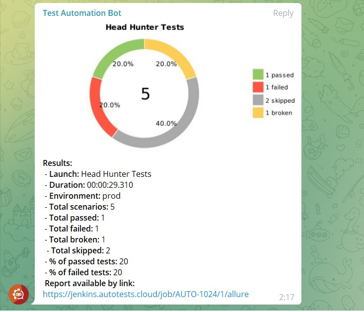

# Проект по автоматизации тестирования для  Head Hunter, сайта поиска работодателя и работника	:star2:
## <a target="_blank" href="https://spb.hh.ru/">Веб сайт Head Hunter</a>

	

## :clipboard:: Содержание:

- <a href="#trophy-технологии-и-инструменты">Технологии и инструменты</a> 
- <a href="#heavy_check_mark-реализованные-проверки">Реализованные проверки</a>
- <a href="#clipboard_mark-сборка-в-Jenkins">Сборка в Jenkins</a>
- <a href="#computer-запуск-из-терминала">Запуск из терминала</a>
- <a href="#chart_with_downwards_trend-allure-отчет">Allure отчет</a>
- <a href="#bar_chart-интеграция-с-allure-testops">Интеграция с Allure TestOps</a>
- <a href="#chart_with_upwards_trend-интеграция-с-jira">Интеграция с Jira</a>
- <a href="#iphone-отчет-в-telegram">Отчет в Telegram</a>
- <a href="#movie_camera-видео-примеры-прохождения-тестов">Видео примеры прохождения тестов</a>

## :trophy:Технологии и инструменты
![Intelij_IDEA] (design/icons/Intelij_IDEA.png)
![AllureTestOps] (design/icons/AllureTestOps.png)
                                                                                                         
  Java Gradle IntelliJ IDEA Selenide Selenoid JUnit5 Jenkins Allure Report Allure TestOps Telegram Jira

</br>


## 	:heavy_check_mark: Реализованные проверки
Раздела "Сервисы для соискателей на главной странице
Выбора города (на примере Санкт-Петербурга)
Поиск вакансий Тестировщик"
Поиск вакансии "Тестировщик" в городе Санкт-Петербург
Поиск и переход на страницу статьи "Что такое сильные стороны и как их определить?"

## :clipboard: Сборка в Jenkins
### <a target="_blank" href="https://jenkins.autotests.cloud/job/AUTO-1024/">Сборка в Jenkins</a>




###  :clipboard: Параметры сборки в Jenkins:
Сборка в Jenkins

- browser (браузер, по умолчанию chrome)
- version (версия браузера, по умолчанию 99.0)
- size (размер окна браузера, по умолчанию 1920x1080)
- threads (количество потоков)
- необходимо добавить файл credentials.properties (содержащий в себе логины и пароли, пример в папке resources)

## :computer: Запуск из терминала
Локальный запуск:
```
gradle clean test
```

Удаленный запуск:
```
clean
test
-Dbrowser=${BROWSER}
-Dsize=${BROWSER_SIZE}
```

## :chart_with_downwards_trend: Allure отчет
- ### Главный экран отчета

 


- ### Страница с проведенными тестами



## :bar_chart: Интеграция с Allure TestOps
- ### Экран с результатами запуска тестов
                                                                            


- ### Страница с тестами в TestOps


                                                                            
## :chart_with_upwards_trend:	 Интеграция с Jira
- ### Страница с задачей в Jira
                                                                                
 


## 	:iphone: Отчет в Telegram

 


## :movie_camera: Видео примеры прохождения тестов


https://user-images.githubusercontent.com/83497921/169714032-3b6d17f6-c509-4f1c-8b71-8cbed0ab368c.mp4


:heart: <a target="_blank" href="https://qa.guru">qa.guru</a><br/>
:blue_heart: <a target="_blank" href="https://t.me/qa_automation">t.me/qa_automation</a>
